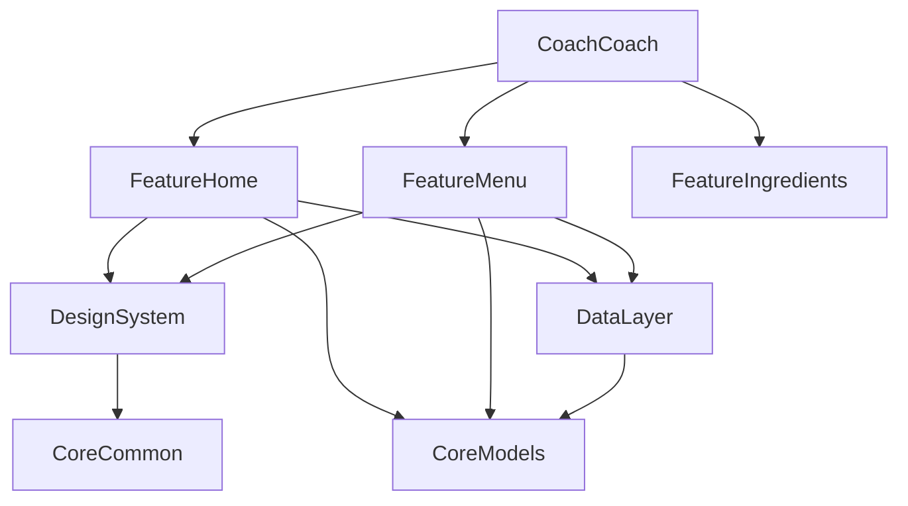

# Project Architecture

## Overview

CoachCoach는 소상공인을 위한 메뉴별 수익성 분석 및 코칭 iOS 애플리케이션입니다.
**SwiftUI**, **The Composable Architecture (TCA)**, **Tuist**를 기반으로 한 모듈화 아키텍처를 채택하고 있습니다.

## Layer Structure

```
CoachCoach (App)           # Application Layer - 앱 진입점, 최상위 Reducer
├── Feature/               # Feature Modules (화면/기능 단위)
│   ├── FeatureHome
│   ├── FeatureMenu
│   ├── FeatureIngredients
│   └── FeatureAICoach
├── Core/                  # Core Modules (도메인, 공통 기능)
│   ├── CoreModels         # 도메인 모델 (Entities)
│   └── CoreCommon         # 공통 유틸리티 (Extensions, Constants)
├── DesignSystem           # UI Components, Assets, Colors, Fonts
└── DataLayer              # Data Repositories, API Clients, Local Storage
```

## Dependency Graph



- **Feature Modules**: 특정 기능(화면)을 담당하며, UI와 비즈니스 로직(Reducer)을 포함합니다.
- **DesignSystem**: 앱 전반의 UI 컴포넌트와 리소스를 관리합니다. 의존성이 가장 적어야 합니다.
- **CoreModels**: 순수 데이터 모델(Struct)을 정의합니다.
- **DataLayer**: 외부 시스템(API, DB)과의 통신을 담당하며, TCA Dependency로 주입됩니다.

## Tech Stack

| Category | Technology | Version |
|----------|------------|---------|
| Language | Swift | 5.9+ |
| UI | SwiftUI | iOS 16.0+ |
| Architecture | The Composable Architecture (TCA) | 1.x |
| Build Tool | Tuist | 4.x |
| Dependency Manager | Swift Package Manager (SPM) | - |

## Build Logic (Tuist)

`Tuist/ProjectDescriptionHelpers`를 통해 프로젝트 설정을 관리합니다.

- `Project+Templates.swift`: 모듈 생성 템플릿 (`makeFramework`, `makeApp`)
- `Dependencies.swift`: 외부 라이브러리 의존성 정의

## Key Patterns

### Navigation
TCA의 `StackState`와 `StackAction`을 사용한 Path 기반 네비게이션을 주로 사용합니다.

### Dependency Injection
TCA의 `@Dependency` 프로퍼티 래퍼를 사용하여 의존성을 주입합니다.
Live/Test/Preview 환경에 따라 다른 구현체를 주입할 수 있습니다.

### Modularity
각 Feature는 독립적인 모듈로 빌드 가능해야 하며, `Project.swift`에 정의됩니다.
이를 통해 기능 단위의 독립적인 개발과 빠른 빌드 속도를 보장합니다.

### UI Interoperability
- 기본적으로 SwiftUI를 사용합니다.
- 고도화된 UI 커스터마이징이 필요한 경우(e.g., Wheel Picker) `UIViewRepresentable`을 통해 UIKit 컴포넌트를 래핑하여 사용합니다.
